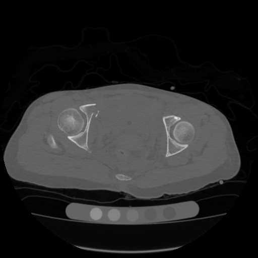
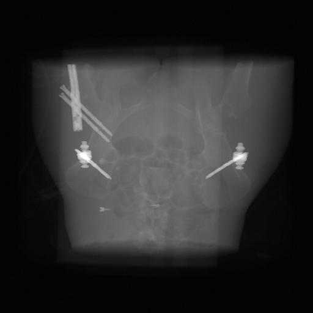
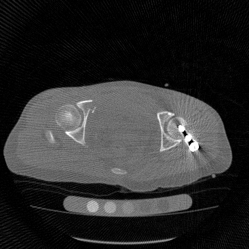

# CBCTSym
An implementation for generating simulated datasets for CBCT scans.

# Why?
Because, no public dataset is available for CBCT metal artifact training.

# How?
We follow the implementation provided in "Convolutional Neural Network Based Metal Artifact Reduction in X-ray Computed Tomography," by Yanbo Zhang and Hengyong Yu, 2018, which was used to generate the dataset for CT scans. However, the corresponding code was in MATLAB, and the metal dataset was not available. We will use the same approach to generate the dataset for CBCT scans using python and open source CT dataset.

We will use open source CTPelvic1K Dataset dataset for non-metal images and Clinic Metal dataset to generate the metal masks. Further, we will use TIGRE toolbox to generate the metal artifact projections and fdk-reconstrcuted images.

# Steps
1. Download the non-metal CT images from [CTPelvic1K Dataset6](https://zenodo.org/records/4588403/files/CTPelvic1K_dataset6_data.tar.gz?download=1), place all the zip files under the folder dataset/deeplesion.
2. Download metal corrputed dataset from [Clinic Metal](https://zenodo.org/records/4588403/files/CTPelvic1K_dataset7_data.tar.gz?download=1), place the extracted files under the folder dataset/metals.
3. Since I can not find the metal only segmentation online, I will segment the metals using thresholding from the metal corrupted images obtained from the data in step 2.
4. Generate the metal only images using the segmentation masks obtained from step 3.
5. Generate the metal artifact images by adding the metal only images to the non-metal images and following the metal simulation process in Yanbo Zhang and Hengyong Yu, 2018.

# Example images

<table style="border-collapse: collapse; padding: 0; margin: 0;">
  <tr>
    <td style="text-align: center;">
    Ground truth<br>
      
    <td>
    <td style="text-align: center;">
    Simulated metal projection<br>
      
    <td>
    <td style="text-align: center;">
      Simulated metal artifact<br>
      
    <td>
    <td style="text-align: center;">
      Only-metal image<br>
      
    </td>
  </tr>
</table>
# Note
The images are converted to positve values to save them as unsigned 16 bit images (range of 0-65535). This saves the storage space. Further, the images are shifted by 1000 HU, therefore, water is 1000 HU and air is 0 HU, instead of the usual -1000 HU and 0 HU.

# Installation
1. Clone the repository using the following command:
```git clone git@github.com:harshitAgr/CBCTSym.git```
2. Change the directory to the cloned repository:
```cd CBCTSym```
3. Install the required packages using the requirements.txt file.
```pip install -r requirements.txt```
4. Install the TIGRE toolbox using the following commands at: [TIGRE](https://github.com/CERN/TIGRE/blob/master/Frontispiece/python_installation.md)

# Using the code

1. Run the code using the following command:
```python cbctsym/prepare_dataset.py -c path/to/config.yaml```

The code will load the config.yaml file, which contains various parameters for the dataset generation. The code will generate the dataset and save it in the specified output directory. The correspondig config file will also be saved for future reference. Pease, check [config file](./cbctsym/config.yaml) for the available default parameters.

# Citation

If you find this code useful, you can cite this repository:
```
@misc{cbctsym,
  author = {Agrawal, H.},
  title = {CBCTSym: An implementation for generating simulated datasets for CBCT scans},
  year = {2024},
  howpublished = {Github},
  url = {https://github.com/harshitAgr/CBCTSym}
}
```

Please, also consider citing the original paper:

```
@article{zhang2018convolutional,
  title={Convolutional neural network based metal artifact reduction in X-ray computed tomography},
  author={Zhang, Yanbo and Yu, Hengyong},
  journal={IEEE transactions on medical imaging},
  volume={37},
  number={6},
  pages={1370--1381},
  year={2018},
  publisher={IEEE}
}

```
and TIGRE toolbox: 

```
@article{biguri2016tigre,
  title={TIGRE: a MATLAB-GPU toolbox for CBCT image reconstruction},
  author={Biguri, Ander and Dosanjh, Manjit and Hancock, Steven and Soleimani, Manuchehr},
  journal={Biomedical Physics & Engineering Express},
  volume={2},
  number={5},
  pages={055010},
  year={2016},
  publisher={IOP Publishing}
}

```
